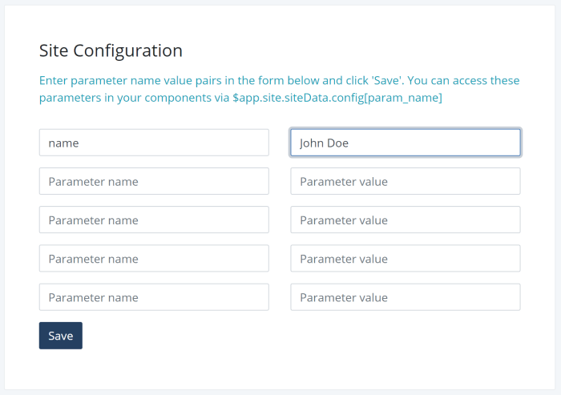

# Site Configuration
Some times it is useful to deploy an application on multiple Web sites and parametrize it to modify its behavior.
As an example, the singlepage-js resume demo app displays the name of the person in the mobile view. This name
is embedded in App.vue file as shown in the listing below.

```html
        <span class="d-block d-md-none">
          {{ $app.site.siteData && $app.site.siteData.siteConfig && $app.site.siteData.siteConfig.name ? 
              $app.site.siteData.siteConfig.name : 'Smita Patil'}}
        </span>
```
 The resume app uses a site configuration parameter named `name` which can be set differently on each instance of the 
 deployed app. `singlepage-js` provides a form for setting site-specific configuration properties. You can
 access the form by switching on edit mode after you log in with `SUPERADMIN` role. Click on `Edit Site Metadata`
 option on the top right dropdown menu to open the form.



The Site Metadata form allows you to define up to 5 site configuration parameters. In the example shown in the
snapshot above, it defines one parameter called `name` with it's value set to `John Doe`.