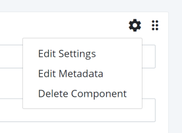
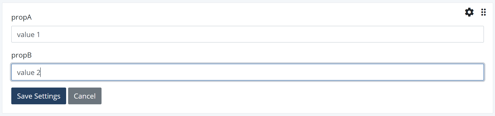
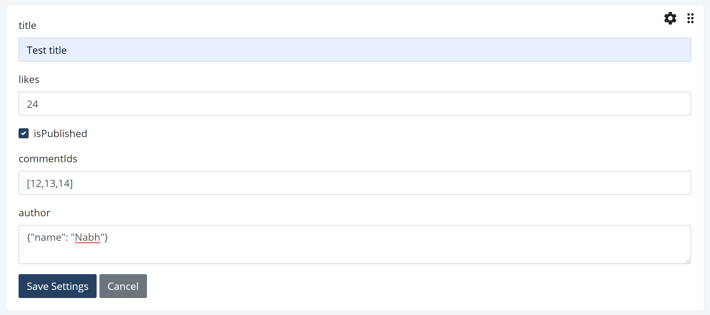
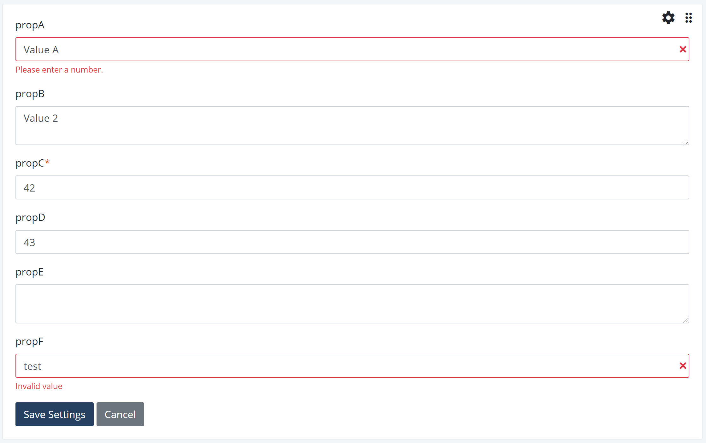

# Component Property Editor
## Default Property Editor
If a component defines `props`, Singlepage automatically creates a form for editing component properties. The form can be
opened by selecting `Edit Settings` option in the component dropdown menu accessible by clicking on the `gear` icon on 
the component window. 



### Properties Defined as Array
The simplest way to define properties in Vue is to define an array of strings as shown below:

```javascript
props: ['propA', 'propB']
```

In the example property definition shown above, Singlepage will create a component settings form shown below:



### Property Object
Vue allows you to define property types. The property specification listed below is taken from Vue.js documentation and
shows how you can define property types.

```javascript
    props: {
      title: String,
      likes: Number,
      isPublished: Boolean,
      commentIds: Array,
      author: Object,
      callback: Function,
      contactsPromise: Promise // or any other constructor
    }
```

Singlepage does not recognize Function and Promise but it creates a property editor shown below. Arrays have to be entered in the
Javascript array notation. Object properties are to be specified as a JSON object. Singlepage validates both of the property types
by attempting to create a Javascript array and an object respectively.



### Advanced Property Specification
In its most advanced form, Vue.js allows component developers to define properties with their data type and validators. 
The example below is also taken from Vue.js documentation.

```Javascript
    props: {
        // Basic type check (`null` and `undefined` values will pass any type validation)
        propA: Number,
        // Multiple possible types
        propB: [String, Number],
        // Required string
        propC: {
          type: String,
          required: true
        },
        // Number with a default value
        propD: {
          type: Number,
          default: 100
        },
        // Object with a default value
        propE: {
          type: Object,
          // Object or array defaults must be returned from
          // a factory function
          default: function () {
            return { message: 'hello' }
          }
        },
        // Custom validator function
        propF: {
          validator: function (value) {
            // The value must match one of these strings
            return ['success', 'warning', 'danger'].indexOf(value) !== -1
          }
        }
      }

```

The property spec above will show the editor shown below. In this case, the validator for propF will be used
to validate the values for propF.


