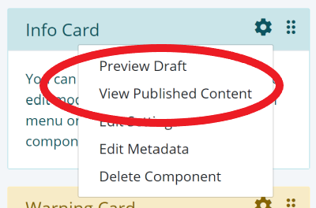

# Customizing Component Menu
We saw how Singlepage creates `Edit Settings` option in the component menu and a form for editing component properties by parsing `props` 
attribute of your Vue.js component. For most components, this might be sufficient. There are situations, however, 
where you may want to customize the `Edit Settings` form and add commands to the component's drop-down menu. 
Singlepage provides a mechanism for doing just that. One of
the built-in components `Html.vue` uses this feature to create a custom property editor and commands that allow 
the user to switch between published content and draft content. 



You can create the custom entries for a component by
defining an `actions` attribute in the `data` section. The `data` specification for `Html.vue` is shown below.

```Javascript
      data: function() {
        return {
          mode: 0,
          actions: {
            settings: 
              {
                fields: [
                  { name: 'content', required: true, label: 'msg_published_content', rows: 6, type: 'textarea'},
                  { name: 'draft', label: 'msg_draft_content',  rows: 6, type: 'textarea'}
                ]
              },
            commands: [
              {
                name: "view-draft",
                label: "msg_view_draft",
                action: this.viewDraft.bind(this)
              },
              {
                name: "view-published",
                label: "msg_view_published",
                action: this.viewPublished.bind(this)
              }
            ]
          }
        };
      }
  ```

  As shown in the listing, the `actions` object has two attributes: `settings` and `commands`. `settings` defines
  a JSON form that is processed by Singlepage built-in component `Form`. The `commands` array adds two options to the
  component dropdown menu and specifies corresponding methods to be executed when the user clicks on those options. The 
  `Html.vue` command method implementation is shown below.

  ```javascript
        methods: {
          viewPublished: function() {
            this.mode = 0;
          },
          viewDraft: function() {
            this.mode = 1;
          }
      }

  ```

In this case, the command method change the `mode` flag which is used by the view template to decide whether to display
published content or the draft.