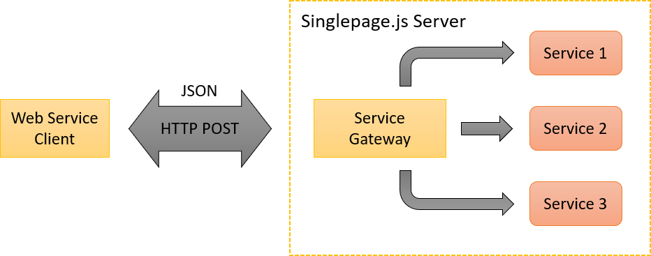

# Web Services Framework Overview
## Introduction
`singlepage-js` provides a `Service Gateway` for invoking methods on backend services registered with `singlepage-js` server. Clients invoke a Web service 
by making an HTTP POST call on the `singlepage-js` server. When the `Service Gateway` receives the call, it first identifies the service being called, ensures that
the current caller is allowed to call the specified method on the service. If the caller has access, it invokes the corresponding method on the 
service object and returns a JSON object to the caller. 

`singlepage-js` service invocation is tightly coupled with the user sessions maintained by the server. The current implementation captures the session information
using HTTP(S) cookies. The `Service Gateway` passes the user and client context information to the service along with method parameters. Details of the service call
parameters are given in section `Implementing Web Service`.

## Built-In Services

`singlepage-js` expects certain core services to be always available in all `singlepage-js` applications. Services that can be invoked from a client include:
 * SessionService - Manages user sessions and provides methods for logging in/out
 * UserService - Provides user management
 * SiteService - Manages portal structure definition and other metadata for a `singlepage-js` Website
 * AppService - Convinence service that returns application data to the client when a user visits or logs in a site

In addition, `singlepage-js` provides some internal services that are used from the server side:
* ObjectStore - Manages persistent storage of system objects
* Cache - Service for caching frequently used data
* EmailService - Send emails using configured templates
* FileStore - Persistent store for files
* TemplateService - Template manager, predominantly used for email templates
