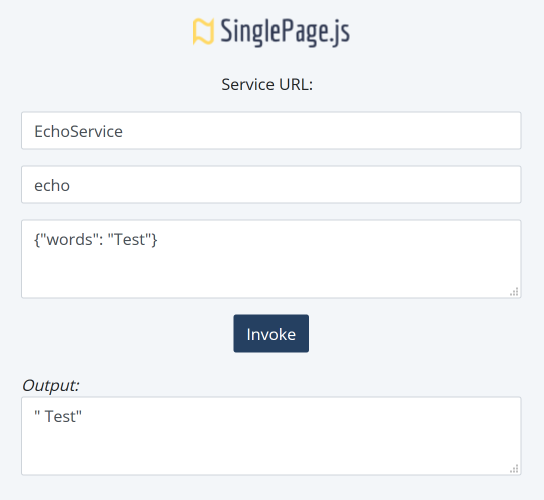

# Testing Your Service

SinglePage provides a simple UI for testing your Web services. It can be accessed via URL: http://<sp-server-url>/sp-files/service_tester.html. For example if you have just installed and run SinglePage server with out-of-the-box configuration, you can access the UI via http://localhost:8080/sp-files/client/service_tester.html. A snapshot of the UI is shown below. The input corresponds to invocation of divide method on the CalculatorService.

